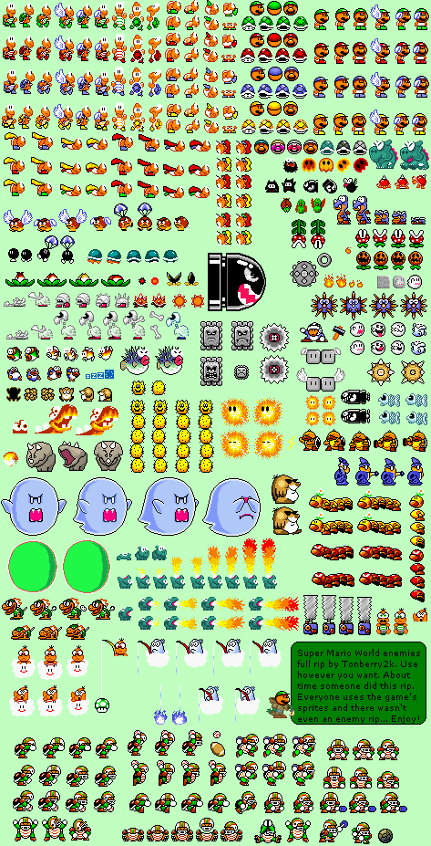

Generate Color Palettes
=========================

A ruby script that generates a color palette image containing all of the colors in a given set of images, sorted by hue. This is using ImageMagick / RMagick

Prerequisites
--------------

- [Install ImageMagick](http://imagemagick.org/)
- [Install RMagick](https://github.com/rmagick/rmagick)

Usage & Examples
------------------

You can pass in any number of command line arguments, which can be images or directories. If you pass in a directory, the script will use all the images in that directory (it won't recurse into subdirectories, though). The script will generate palette.png, containing all the colors.

`ruby gen_palette.rb sample_imgs`

or

`ruby gen_palette.rb sample_imgs/smw_tiles.png sample_imgs/smw_enemies.png`

This turns these two images:

Into this palette image:

TODO
--------

The color sort is only OK, but my lack of color knowledge prevents me from making it much better.

Feedback & pull requests welcome!